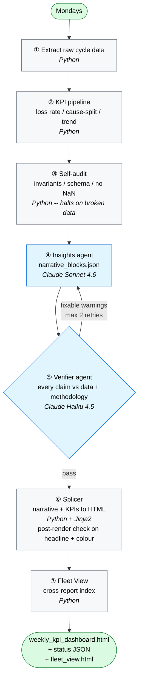

# Weekly multi-agent reports

[](https://github.com/barbararomeira/weekly-automated-multi-agent-reports/actions/workflows/ci.yml)
[](https://www.python.org/downloads/)
[](./LICENSE)

> A template for **scheduled multi-agent reports**: a deterministic data pipeline does the maths, one LLM agent writes the narrative, and a second LLM agent fact-checks every claim against the data before anything is rendered.

The example use case in this repo is a weekly manufacturing performance report, but the pattern works anywhere you need an LLM to produce something it has to get **factually right** — ops digests, account-health reports, financial summaries, incident reviews.

---

## Quickstart

Two pre-generated HTML files live in this repo. They were produced by the system itself, on the included synthetic data. No install, no setup — just click:

- [`examples/sample_dashboard.html`](./examples/sample_dashboard.html) — the customer-facing weekly report (4 Plotly charts + the LLM-written narrative panel)
- [`examples/sample_fleet_view.html`](./examples/sample_fleet_view.html) — the cross-report index across multiple lines / customers

To regenerate them yourself on your machine:

```bash
git clone https://github.com/barbararomeira/weekly-automated-multi-agent-reports
cd weekly-automated-multi-agent-reports
python3 -m venv .venv && source .venv/bin/activate
pip install -e ".[dev]"
python run_weekly.py --mock --as-of 2026-05-21
```

The `--mock` flag swaps the LLM calls for fixed JSON files in `fixtures/`, so this works with no external setup. Every other step (KPI maths, audit, splicing, fleet-view assembly) executes for real, so the system runs end-to-end on your laptop.

---

## The pattern — what makes this multi-agent setup worth copying

If you're building anything where an LLM has to be **factually right** (not just creative or fluent), three design choices in this repo are worth stealing:

**1. Deterministic spine + narrow agent boundary.** Everything that can be computed — KPIs, aggregations, exclusion rules, chart binding, HTML rendering — is plain Python. The LLM only does the parts where judgment helps: writing the narrative and checking it against the data. Smaller agent surface = cheaper, faster, more reviewable.

**2. Verifier agent runs BEFORE rendering.** Most LLM systems generate the output and *then* optionally check it. By that point it's too late: if a wrong number reaches a customer, the trust hit is irreversible. Here, a second agent (cheaper model: Haiku) compares every numeric claim in the narrative against the underlying CSVs **before** any HTML is generated. Bad claims either trigger a re-write loop or halt the run.

**3. Two models, two roles.** The writer is Sonnet (one call per run, ~9k output tokens — the eloquent part). The verifier is Haiku (structured JSON comparison — it needs accuracy, not eloquence). Asymmetric model choice matters: using the same heavyweight model for both buys no accuracy on the verifier's task.

The full set of design + methodology trade-offs (27 of them, with *chose / considered / why* for each) lives in [DECISIONS.md](./DECISIONS.md).

---

## Architecture at a glance



**Blue** = LLM steps. **Grey** = deterministic Python. **Green** = the weekly trigger and the final published outputs. The agent boundary is narrow on purpose — everything outside steps ④ and ⑤ is deterministic, which means cheaper, faster, more reviewable.

---

## Key engineering decisions

Six highlights — the full *chose / considered / why* for all 27 lives in [DECISIONS.md](./DECISIONS.md).

| # | Decision | Why this shape |
|---|---|---|
| 7 | **Agent emits structured JSON, not HTML.** | Layout, KPI widgets, trend colours, and chart binding stay in code. Easier to test the splicer in isolation, easier to swap models without breaking the dashboard. |
| 9 | **Verifier runs BEFORE HTML splicing.** | "Render then re-check" is too late — wrong numbers reaching a customer are an irreversible trust hit. Verifying upstream catches hallucinations + methodology drift while there's still time to fix. |
| 18 | **Auto-fix loop for fixable warnings; cap at 2 retries.** | Doing N retries silently masks real methodology problems behind a "looks-clean" pass. The cap forces human attention when the loop doesn't converge. |
| 20 | **Self-audit catches bugs, not judgment calls.** | Broken data halts cheap (before any LLM call). "Sparse week, can't really call a slope" is an interpretation question and belongs to the Insights agent + methodology — conflating them produces bad halts and bad narratives. |
| 24 | **Single Python orchestrator; no subprocess fan-out.** | Subprocess + filesystem state between steps invites flakiness (race conditions on `outputs/`, lost stderr, partial writes). One process keeps the failure surface obvious. |
| 26 | **Sonnet for narrative, Haiku for verifier.** | Asymmetric model choice. The verifier is a JSON-comparison job, not a writing job — using the same heavyweight model for both buys no accuracy. |

---

## Run it locally (mock mode)

**Requirements:** Python 3.11 or newer, Git, a terminal.

```bash
git clone https://github.com/barbararomeira/weekly-automated-multi-agent-reports
cd weekly-automated-multi-agent-reports
python3 -m venv .venv && source .venv/bin/activate
pip install -e ".[dev]"
python run_weekly.py --mock --as-of 2026-05-21
```

What `--mock` does: instead of calling the LLM, the pipeline copies pre-recorded agent outputs from `fixtures/` into the run. Every other step (KPI maths, audit, schema validation, HTML splicing, fleet-view assembly) executes for real — so you see the full system end-to-end without spending anything on API calls.

After the run, you'll find these files:

| File | What it is |
|---|---|
| `outputs/weekly_kpi_dashboard.html` | The customer-facing dashboard — **open this first in a browser**. |
| `outputs/narrative_blocks.json` | Insights-agent output, validated against `architecture/schemas/narrative_blocks.schema.json`. |
| `outputs/verifier_report.json` | Verifier output, severity-tagged warnings. |
| `outputs/*.csv` (×6) | Pipeline aggregates the agents read — weekly, per-shift, per-weekday, cause split, exclusions, productive hours. |
| `status/demo.json` | Per-report status — read by the Fleet View and by next week's Insights agent. |
| `fleet_view.html` | Cross-report index. Surfaces verifier failures inline. |

---

## Useful flags

```bash
# Override a verifier false positive — justification is mandatory and gets recorded in the dashboard footer.
python run_weekly.py --override w1 "short reason — what made this a false positive"

# Re-run a past week.
python run_weekly.py --as-of 2026-05-13
```

For the operational failure modes ("verifier halted," "auto-fix loop exhausted," "broken data audit," "new monthly data drop"), see [RUNBOOK.md](./RUNBOOK.md).

---

## Use it on your own data

The repo ships as a working template against synthetic manufacturing data. To point it at your own data, three things change:

**1. Point the pipeline at your CSV.** The bundled sample sits at `fixtures/synthetic_cycles.csv` and is what the pipeline reads by default. To use your own data, pass `--input-path`:

```bash
python run_weekly.py --input-path /path/to/your_data.csv --as-of 2026-05-21
```

Your CSV needs these four columns, one row per cycle:

| Column | Type | Notes |
|---|---|---|
| `timestamp_start` | datetime | ISO 8601, no timezone (e.g. `2026-05-21T07:14:32`) |
| `cycle_seconds` | float | Total observed duration of the cycle |
| `loss_seconds` | float | Excess over your SOP target; `0` when the cycle ran on-target |
| `loss_cause` | string | Cause label for the loss; empty when there was none. The synthetic fixture uses `machine_wait`, `material`, `operator_absent`, `rework`, `changeover` — yours can use any taxonomy that fits your domain. |

Open `fixtures/synthetic_cycles.csv` to see what a few rows look like.

**2. Edit the methodology.** [`methodology/context.md`](./methodology/context.md) is the rulebook the agents read at runtime — what counts as a "shift," when data is too sparse to draw a trend, what units to use, what framings to avoid. Edit this file to match your domain; the agents pick up the changes on the next run, no code change needed.

**3. Add a config.** Copy [`config/demo.example.yaml`](./config/demo.example.yaml) to `config/<your-report-id>.yaml` and adjust `report_id`, `customer`, `line_name`, `sop_seconds`, `exclusion_threshold_cycles`. Real configs are gitignored — yours won't accidentally end up in a commit.

For deeper changes ("how do I adapt the KPIs themselves?"), the entry points are `scripts/kpi_pipeline.py` (where the maths happens) and the agent contracts in [`architecture/agents/`](./architecture/agents/).

---

## Tests

```bash
pytest
```

**39 tests** covering: shift-classification edge cases, largest-remainder cause-split allocation, OLS slope + trend classification, post-render-check tampering detection, the audit's bug-catching, and an end-to-end orchestrator integration test in mock mode. CI runs the same suite + a smoke test on every push, against Python 3.11 and 3.12.

---

## Repo map

| Path | Purpose |
|---|---|
| `run_weekly.py` | Orchestrator — the entrypoint |
| `scripts/` | KPI pipeline, audit, splicer, fleet-view builder, the two agents |
| `architecture/` | JSON schemas + per-agent contracts (input / output / failure modes) |
| `methodology/context.md` | Methodology spec, edited as a file, read by the agents at runtime |
| `fixtures/` | Synthetic cycle data + mock agent outputs (lets `--mock` run anywhere) |
| `examples/` | Pre-generated sample dashboard + fleet view |
| `config/` | One YAML per report. `config/demo.example.yaml` is the template. |
| `tests/` | pytest suite |
| `DECISIONS.md` | All 27 design + methodology decisions, with *chose / considered / why* |
| `RUNBOOK.md` | Operational scenarios |

---

## Contributing

Issues and PRs welcome — see [CONTRIBUTING.md](./CONTRIBUTING.md) for setup and what should pass before opening a PR.

---

## License

[MIT](./LICENSE).

---

## Deeper reading

1. **[DECISIONS.md](./DECISIONS.md)** — all 27 design + methodology decisions with *chose / considered / why*. The spine of the project.
2. **[architecture/overview.md](./architecture/overview.md)** — system shape + end-to-end data flow.
3. **[methodology/context.md](./methodology/context.md)** — the methodology spec the agents read at runtime. Decoupling rules from prompts lets you update one without touching the other.
4. **[architecture/agents/insights_agent.md](./architecture/agents/insights_agent.md)** and **[verifier_agent.md](./architecture/agents/verifier_agent.md)** — agent contracts: inputs, outputs, prompt skeleton, failure modes.
5. **[architecture/schemas/](./architecture/schemas/)** — JSON schemas between agents and the rest of the system.
6. **[RUNBOOK.md](./RUNBOOK.md)** — operational scenarios.
